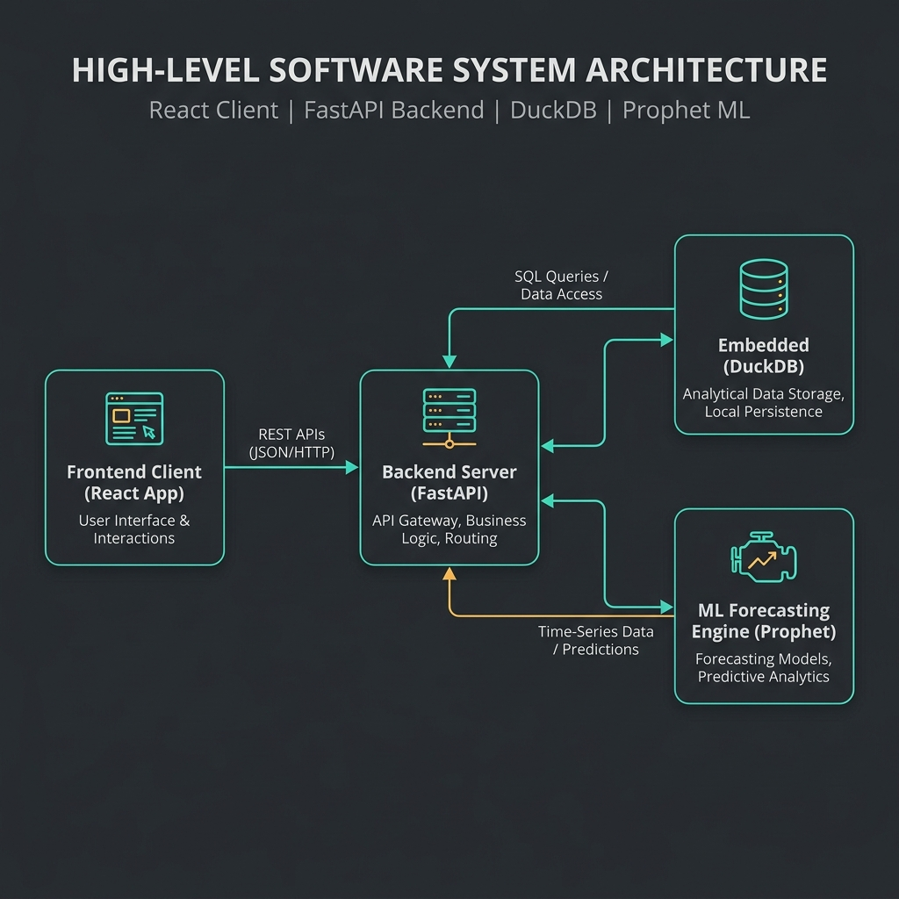
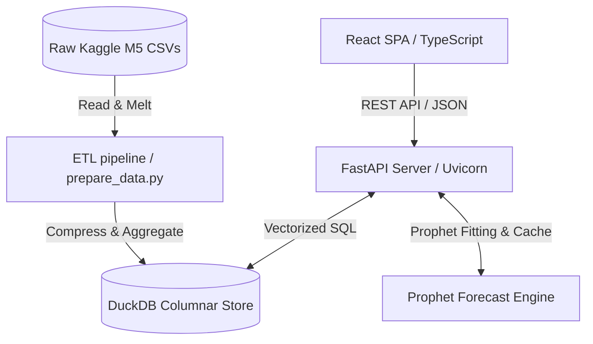
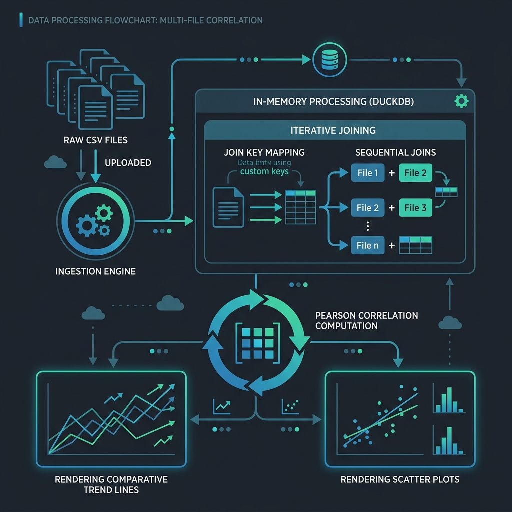
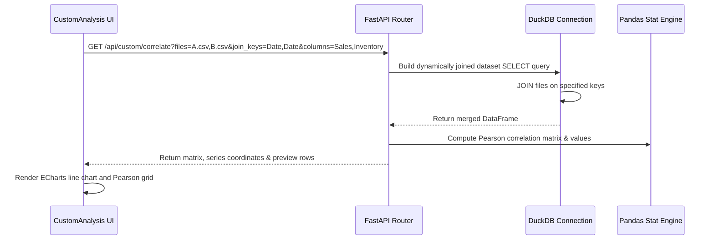

# DemandDoc — System Architecture & Technical Documentation

This document provides a comprehensive technical overview of the architecture, database schema, machine learning forecasting engine, frontend reactive state, and data flow pipelines for the **DemandDoc** Retail Demand & Sales Analytics platform.

---

## 1. Directory Structure & Code Organization

```
demandDoc/
├── backend/
│   ├── app/
│   │   ├── __init__.py
│   │   ├── database.py       # DuckDB OLAP store context manager
│   │   ├── forecast.py       # Prophet training, forecasting & caching engine
│   │   ├── main.py           # FastAPI entry point & CORS configuration
│   │   ├── routes.py         # REST routers, DuckDB queries & multi-file join engines
│   │   └── schemas.py        # Pydantic schema declarations
│   ├── data/
│   │   ├── raw/              # Directory for raw uploaded CSVs and Kaggle datasets
│   │   └── warehouse.duckdb  # Materialized OLAP columnar database
│   ├── pipeline/
│   │   └── prepare_data.py   # ETL script for melting, cleaning, and pre-aggregating raw CSVs
│   └── tests/
│       └── test_api.py       # Pytest suite for backend endpoints
├── frontend/
│   ├── src/
│   │   ├── api/
│   │   │   └── client.ts     # Axios instance and API routes
│   │   ├── components/
│   │   │   ├── layout/
│   │   │   │   ├── Sidebar.tsx  # Navigation list & multi-file batch uploader
│   │   │   │   └── Topbar.tsx   # Global filter panels & print buttons
│   │   │   ├── panels/
│   │   │   │   ├── CategoryTreemap.tsx    # Sales hierarchy visualization
│   │   │   │   ├── GeographicInsights.tsx # Horizontal breakdown of locations
│   │   │   │   ├── CustomAnalysis.tsx     # Single-file profiles & N-file correlations
│   │   │   │   └── InventoryAnalysis.tsx  # Lead-time & Safety Stock calculators
│   │   │   └── PdfReport.tsx  # White-background print-ready PDF SWOT layout
│   │   ├── store/
│   │   │   └── useStore.ts    # Zustand global state manager
│   │   ├── App.tsx            # Main application layout manager
│   │   ├── index.css          # Tailwind/CSS custom styles and print media rules
│   │   └── main.tsx           # React bootstrap entry point
│   ├── index.html             # Webpage DOM template
│   ├── package.json           # Frontend dependencies
│   └── vite.config.ts         # Vite bundler options
└── ARCHITECTURE.md            # System Architecture guide
```

---

## 2. High-Level Architecture (HLD)

DemandDoc is built on a decoupled, asynchronous multi-tier architecture designed for low-latency BI queries and interactive ML visualizations.





---

## 3. Data Warehouse & Database Schema (DuckDB)

DuckDB is utilized as an in-process columnar database. The raw M5 transactional files contain daily sales quantities for items across multiple stores in a wide pivot layout. The ETL pipeline (`prepare_data.py`) unpivots this data into a highly compressed columnar layout.

### A. Core Schema Tables
1. **`sales_train_evaluation`** (Fact Table): Unpivoted transaction record list.
   * `id` (VARCHAR): SKU identifier.
   * `item_id` (VARCHAR): Product type ID.
   * `dept_id` (VARCHAR): Product department ID.
   * `cat_id` (VARCHAR): Product broad category ID.
   * `store_id` (VARCHAR): Store ID.
   * `state_id` (VARCHAR): State location code (CA, TX, WI).
   * `d` (VARCHAR): Day identifier (e.g., `d_1`, `d_1941`).
   * `units` (INTEGER): Number of items sold.

2. **`calendar`** (Dimension Table): Calendar metadata map.
   * `d` (VARCHAR): Primary key matching the fact table.
   * `date` (DATE): Gregorian calendar date.
   * `wm_yr_wk` (INTEGER): Walmart fiscal week code.
   * `weekday` (VARCHAR): Name of the day.
   * `wday` (INTEGER): Numeric day of week.
   * `month` (INTEGER): Month number.
   * `year` (INTEGER): Calendar year.
   * `snap_CA`, `snap_TX`, `snap_WI` (BOOLEAN): Flags indicating SNAP eligibility days.

3. **`sell_prices`** (Dimension Table): Product prices.
   * `store_id` (VARCHAR): Store ID.
   * `item_id` (VARCHAR): Item SKU identifier.
   * `wm_yr_wk` (INTEGER): Walmart fiscal week code.
   * `sell_price` (DOUBLE): Item retail price.

### B. Pre-Aggregated Views for Sub-Second Latency
To ensure dashboard queries settle in under 100ms, the pipeline materializes the following aggregated tables in `warehouse.duckdb`:
* **`agg_daily`**: Aggregates unit count, revenue, and prices grouped by `date`, `cat_id`, and `state_id`.
* **`agg_weekly`**: Aggregates grouped by `week_start`, `cat_id`, and `state_id`.
* **`agg_monthly`**: Aggregates grouped by `month_start`, `cat_id`, and `state_id`.
* **`agg_annual`**: Aggregates grouped by `year_start`, `cat_id`, and `state_id`.

---

## 4. Machine Learning & Predictive Pipelines

### A. Demand Forecasting (Prophet)
DemandDoc fits a Prophet time-series model on historical sales trend aggregates:
$$y(t) = g(t) + s(t) + h(t) + \epsilon_t$$
where $g(t)$ is the growth trend, $s(t)$ represents seasonality, $h(t)$ incorporates holiday events, and $\epsilon_t$ is the error term.
* **Pre-computation**: Forecasts are pre-computed at server startup for the combinations of categories and states, then cached in memory to eliminate model fitting delays during interactive user requests.
* **Service Level & Safety Stock Planning**:
  Calculates safety stock levels to buffer against lead time variability:
  $$\text{Safety Stock} = Z \times \sigma_d \times \sqrt{L}$$
  $$\text{Reorder Point (ROP)} = (\mu_d \times L) + \text{Safety Stock}$$
  where:
  - $Z$ is the service level multiplier (e.g., $1.28$ for 90%, $1.64$ for 95%, $2.33$ for 99%).
  - $\sigma_d$ is the standard deviation of daily demand.
  - $L$ is the lead time in days.
  - $\mu_d$ is the mean daily sales volume.

### B. What-If Pricing Scenario Simulator
Uses price elasticity of demand to simulate revenue changes:
$$\epsilon_p = \frac{\% \Delta Q}{\% \Delta P}$$
* When the user adjusts the pricing slider, the frontend sends the price multiplier ($\% \Delta P$) to the `/api/sales/scenario` endpoint.
* The backend queries the current baseline forecast, computes the simulated quantity changes using the elasticity coefficient, and recalculates projected revenues.

---

## 5. N-File In-Memory Correlation Data Flow

When multiple custom CSV files are uploaded, they are joined sequentially in-memory via DuckDB.





---

## 6. Frontend State & Caching Architecture

### A. Zustand Store Properties
* `dateFrom` / `dateTo`: Bound values for date-range queries.
* `category`: Filter string (`ALL`, `FOODS`, `HOBBIES`, `HOUSEHOLD`).
* `stateLocation`: Filter string (`ALL`, `CA`, `TX`, `WI`).
* `granularity`: Time scale (`daily`, `weekly`, `monthly`, `annual`).
* `activeView`: Panel visibility manager.
* `uploadedFilename`: Tracks currently selected custom dataset.
* `uploadedFilenames`: String array tracking all uploaded datasets.

### B. TanStack Query (React Query) Integration
All analytical components fetch data using dynamic query keys that match the state parameters:
```typescript
queryKey: ["customTrend", uploadedFilename, category, stateFilter, dateFrom, dateTo, granularity]
```
This guarantees that whenever a user modifies any filter, React Query automatically initiates a background refetch, retrieves the updated metrics, and re-renders components.

---

## 7. API Reference Schema

### `GET /api/custom/correlate`
* **Query Params**:
  * `files`: Comma-separated list of filenames (e.g., `sales.csv,weather.csv`).
  * `join_keys`: Comma-separated join columns matching each file (e.g., `date,date`).
  * `columns`: Comma-separated metric columns to analyze (e.g., `revenue,temp`).
* **Response**:
  ```json
  {
    "matrix": [
      {
        "file1": "sales.csv",
        "file2": "weather.csv",
        "col1": "revenue",
        "col2": "temp",
        "coefficient": 0.4352
      }
    ],
    "series": [
      {
        "join_key": "2015-01-01",
        "val0": 45020.50,
        "val1": 72.5
      }
    ],
    "row_count": 500,
    "preview_rows": [
      { "join_key": "2015-01-01", "revenue_f0": "45020.50", "temp_f1": "72.5" }
    ],
    "preview_columns": ["join_key", "revenue_f0", "temp_f1"]
  }
  ```