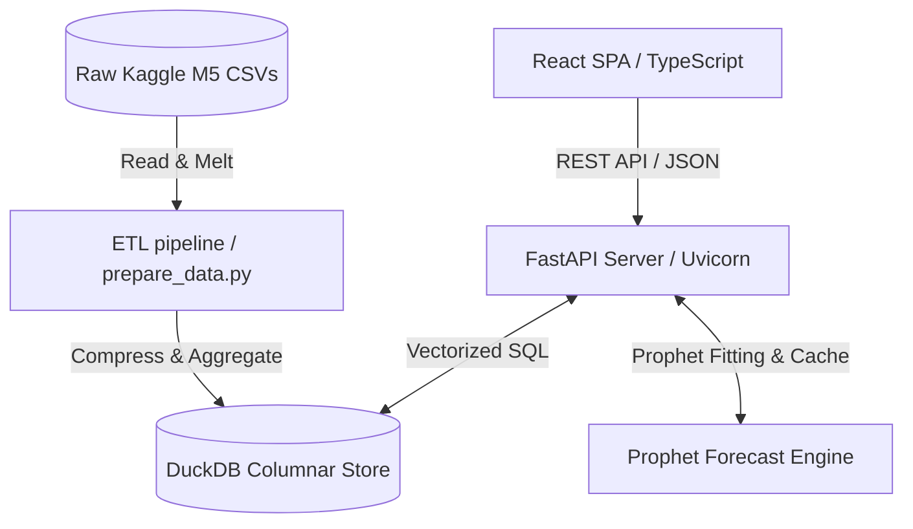
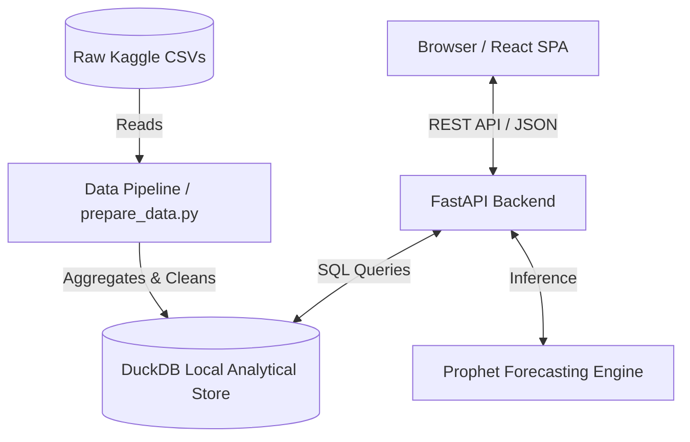
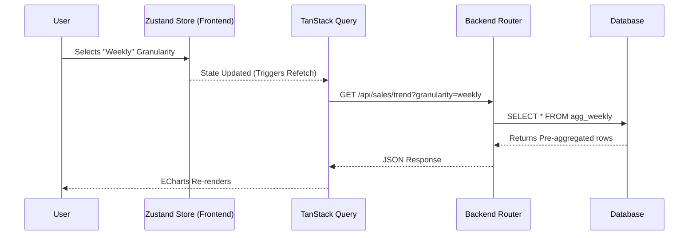
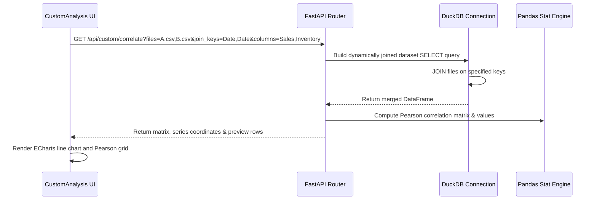

# Architecture & Technical Documentation

This document outlines the architectural decisions, system design, database schema, machine learning forecasting engine, frontend reactive state, data flow, and tech stack utilized in the Retail Demand & Sales Analytics Dashboard.

---

## 1. Directory Structure & Code Organization

```
demandDoc/
├── backend/
│   ├── app/
│   │   ├── __init__.py
│   │   ├── database.py       # DuckDB OLAP store context manager
│   │   ├── forecast.py       # Prophet training, forecasting & caching engine
│   │   ├── main.py           # FastAPI entry point & CORS configuration
│   │   ├── routes.py         # REST routers, DuckDB queries & multi-file join engines
│   │   └── schemas.py        # Pydantic schema declarations
│   ├── data/
│   │   ├── raw/              # Directory for raw uploaded CSVs and Kaggle datasets
│   │   └── warehouse.duckdb  # Materialized OLAP columnar database
│   ├── pipeline/
│   │   └── prepare_data.py   # ETL script for melting, cleaning, and pre-aggregating raw CSVs
│   └── tests/
│       └── test_api.py       # Pytest suite for backend endpoints
├── frontend/
│   ├── src/
│   │   ├── api/
│   │   │   └── client.ts     # Axios instance and API routes
│   │   ├── components/
│   │   │   ├── layout/
│   │   │   │   ├── Sidebar.tsx  # Navigation list & multi-file batch uploader
│   │   │   │   └── Topbar.tsx   # Global filter panels & print buttons
│   │   │   ├── panels/
│   │   │   │   ├── CategoryTreemap.tsx    # Sales hierarchy visualization
│   │   │   │   ├── GeographicInsights.tsx # Horizontal breakdown of locations
│   │   │   │   ├── CustomAnalysis.tsx     # Single-file profiles & N-file correlations
│   │   │   │   └── InventoryAnalysis.tsx  # Lead-time & Safety Stock calculators
│   │   │   └── PdfReport.tsx  # White-background print-ready PDF SWOT layout
│   │   ├── store/
│   │   │   └── useStore.ts    # Zustand global state manager
│   │   ├── App.tsx            # Main application layout manager
│   │   ├── index.css          # Tailwind/CSS custom styles and print media rules
│   │   └── main.tsx           # React bootstrap entry point
│   ├── index.html             # Webpage DOM template
│   ├── package.json           # Frontend dependencies
│   └── vite.config.ts         # Vite bundler options
└── ARCHITECTURE.md            # System Architecture guide
```

---

## 2. High-Level Architecture (HLD)

DemandDoc is built on a decoupled, asynchronous multi-tier architecture designed for low-latency BI queries and interactive ML visualizations.





## 1. High-Level Design (HLD)

The system follows a modern decoupled architecture where a React frontend communicates with a Python/FastAPI backend, which in turn queries a heavily optimized DuckDB analytical database and invokes Prophet for ML forecasting.



---

## 2. Low-Level Design (LLD) & Data Flow

When a user changes a filter (e.g., Granularity from Monthly to Weekly), the data flows as follows:



---

## 3. Tech Stack & Justification

| Component | Technology | Justification |
| :--- | :--- | :--- |
| **Frontend Framework** | React 18 + Vite + TS | High performance, strict typing, and instant HMR via Vite. |
| **State Management** | Zustand | Lightweight and boilerplate-free compared to Redux; perfect for simple global filter states. |
| **Data Fetching** | TanStack Query | Built-in caching, background re-fetching, and loading state management. |
| **Charting** | ECharts (echarts-for-react) | High-performance canvas-based rendering capable of handling thousands of data points smoothly. |
| **Backend Framework** | FastAPI (Python) | Extremely fast, built-in validation via Pydantic, and automatic Swagger docs. |
| **Database** | DuckDB | Embeddable OLAP database. Provides sub-second aggregations over millions of rows without a dedicated server. |
| **Machine Learning** | Prophet | Robust time-series forecasting that handles missing data and large outliers well, explicitly built for retail/business forecasting. |

---

## 4. Data Warehouse & Database Schema (DuckDB)

DuckDB is utilized as an in-process columnar database. The raw M5 transactional files contain daily sales quantities for items across multiple stores in a wide pivot layout. The ETL pipeline (`prepare_data.py`) unpivots this data into a highly compressed columnar layout.

### A. Core Schema Tables
1. **`sales_train_evaluation`** (Fact Table): Unpivoted transaction record list.
   * `id` (VARCHAR): SKU identifier.
   * `item_id` (VARCHAR): Product type ID.
   * `dept_id` (VARCHAR): Product department ID.
   * `cat_id` (VARCHAR): Product broad category ID.
   * `store_id` (VARCHAR): Store ID.
   * `state_id` (VARCHAR): State location code (CA, TX, WI).
   * `d` (VARCHAR): Day identifier (e.g., `d_1`, `d_1941`).
   * `units` (INTEGER): Number of items sold.

2. **`calendar`** (Dimension Table): Calendar metadata map.
   * `d` (VARCHAR): Primary key matching the fact table.
   * `date` (DATE): Gregorian calendar date.
   * `wm_yr_wk` (INTEGER): Walmart fiscal week code.
   * `weekday` (VARCHAR): Name of the day.
   * `wday` (INTEGER): Numeric day of week.
   * `month` (INTEGER): Month number.
   * `year` (INTEGER): Calendar year.
   * `snap_CA`, `snap_TX`, `snap_WI` (BOOLEAN): Flags indicating SNAP eligibility days.

3. **`sell_prices`** (Dimension Table): Product prices.
   * `store_id` (VARCHAR): Store ID.
   * `item_id` (VARCHAR): Item SKU identifier.
   * `wm_yr_wk` (INTEGER): Walmart fiscal week code.
   * `sell_price` (DOUBLE): Item retail price.

### B. Pre-Aggregated Views for Sub-Second Latency
To ensure dashboard queries settle in under 100ms, the pipeline materializes the following aggregated tables in `warehouse.duckdb`:
* **`agg_daily`**: Aggregates unit count, revenue, and prices grouped by `date`, `cat_id`, and `state_id`.
* **`agg_weekly`**: Aggregates grouped by `week_start`, `cat_id`, and `state_id`.
* **`agg_monthly`**: Aggregates grouped by `month_start`, `cat_id`, and `state_id`.
* **`agg_annual`**: Aggregates grouped by `year_start`, `cat_id`, and `state_id`.

---

## 5. Machine Learning & Predictive Pipelines

### A. Optimization & Data Pre-Processing

To ensure sub-second latency on the frontend:
- **Pre-aggregation**: The `prepare_data.py` pipeline melts the wide-format Kaggle CSV (`sales_train_evaluation.csv`) into a columnar fact table and pre-aggregates key metrics.
- **Columnar Storage**: DuckDB stores the analytical tables in a compressed, columnar format (`warehouse.duckdb`), allowing the API to read only the specific columns needed for a visualization.
- **In-Memory Forecast Caching**: Prophet models can take time to fit. The architecture caches trained models or persists daily/weekly forecast points to avoid computing the ML inference during live API calls.

### B. Demand Forecasting (Prophet)
DemandDoc fits a Prophet time-series model on historical sales trend aggregates:
$$y(t) = g(t) + s(t) + h(t) + \epsilon_t$$
where $g(t)$ is the growth trend, $s(t)$ represents seasonality, $h(t)$ incorporates holiday events, and $\epsilon_t$ is the error term.
* **Pre-computation**: Forecasts are pre-computed at server startup for the combinations of categories and states, then cached in memory to eliminate model fitting delays during interactive user requests.
* **Service Level & Safety Stock Planning**:
  Calculates safety stock levels to buffer against lead time variability:
  $$\text{Safety Stock} = Z \times \sigma_d \times \sqrt{L}$$
  $$\text{Reorder Point (ROP)} = (\mu_d \times L) + \text{Safety Stock}$$
  where:
  - $Z$ is the service level multiplier (e.g., $1.28$ for 90%, $1.64$ for 95%, $2.33$ for 99%).
  - $\sigma_d$ is the standard deviation of daily demand.
  - $L$ is the lead time in days.
  - $\mu_d$ is the mean daily sales volume.

### C. What-If Pricing Scenario Simulator
Uses price elasticity of demand to simulate revenue changes:
$$\epsilon_p = \frac{\% \Delta Q}{\% \Delta P}$$
* When the user adjusts the pricing slider, the frontend sends the price multiplier ($\% \Delta P$) to the `/api/sales/scenario` endpoint.
* The backend queries the current baseline forecast, computes the simulated quantity changes using the elasticity coefficient, and recalculates projected revenues.

---

## 5. Frontend State & Caching Architecture

### A. Zustand Store Properties
* `dateFrom` / `dateTo`: Bound values for date-range queries.
* `category`: Filter string (`ALL`, `FOODS`, `HOBBIES`, `HOUSEHOLD`).
* `stateLocation`: Filter string (`ALL`, `CA`, `TX`, `WI`).
* `granularity`: Time scale (`daily`, `weekly`, `monthly`, `annual`).
* `activeView`: Panel visibility manager.
* `uploadedFilename`: Tracks currently selected custom dataset.
* `uploadedFilenames`: String array tracking all uploaded datasets.

### B. TanStack Query (React Query) Integration
All analytical components fetch data using dynamic query keys that match the state parameters:
```typescript
queryKey: ["customTrend", uploadedFilename, category, stateFilter, dateFrom, dateTo, granularity]
```
This guarantees that whenever a user modifies any filter, React Query automatically initiates a background refetch, retrieves the updated metrics, and re-renders components.

---

## 6. API Reference

### `GET /api/sales/kpis`
- **Description**: Retrieves top-level metrics (Revenue, Units Sold, Unique Items).
- **Params**: `granularity` (daily, weekly, monthly), `state_id`, `cat_id`.
- **Response**: `{"revenue": 1200000, "units_sold": 850000, "items": 3049}`

### `GET /api/sales/trend`
- **Description**: Fetches time-series data for the main Revenue Trend line chart.
- **Params**: `granularity`, `start_date`, `end_date`.
- **Response**: `[{"date": "2015-01", "revenue": 45000}, ...]`

### `GET /api/sales/forecast`
- **Description**: Invokes the Prophet model to return predicted future sales.
- **Params**: `granularity`, `periods` (int).
- **Response**: `[{"date": "2016-06", "yhat": 50000, "yhat_lower": 48000, "yhat_upper": 52000}, ...]`

### `GET /api/sales/promotions`
- **Description**: Returns percentage lift for major holiday events.
- **Response**: `[{"name": "Super Bowl", "lift": 0.15}, ...]`

### `GET /api/sales/root_cause`
- **Description**: Returns text-based anomaly explanations.
- **Response**: `[{"date": "2015-11-26", "issue": "Thanksgiving Out of Stock", "impact": -5000}]`

### `GET /api/sales/geographic`
- **Description**: Returns revenue distribution by state for the pie chart.
- **Response**: `[{"state": "CA", "revenue": 500000}, ...]`

### `GET /api/sales/top_products`
- **Description**: Returns the highest selling items in the selected category.
- **Response**: `[{"id": "HOBBIES_1_001", "name": "Item 1", "revenue": 15000}, ...]`

---

## 7. Features & Visualizations Mapping

| Feature | Visual Component | Data Source API | Backend Processing / ML |
| :--- | :--- | :--- | :--- |
| **Top KPIs** | Grid of numeric cards with percent change | `/api/sales/kpis` | Basic `SUM()` and `COUNT()` in DuckDB over the filtered period |
| **Revenue Trend** | ECharts Line Chart (Smooth) | `/api/sales/trend` | Time-series `GROUP BY` aggregations in DuckDB |
| **Category Mix** | ECharts Treemap | `/api/sales/kpis` (Category slice) | Hierarchical aggregation (Dept -> Category -> Item) |
| **Top Products** | Tailwind List/Table | `/api/sales/top_products` | `ORDER BY revenue DESC LIMIT 10` |
| **Demand Forecast** | ECharts Line Chart with Confidence Bands | `/api/sales/forecast` | Scikit-learn / Prophet model fit on historical trend |
| **Promotion Impact** | ECharts Bar Chart (Lift %) | `/api/sales/promotions` | Calculated baseline vs actual sales during SNAP/Events |
| **Anomaly Root Cause** | Markdown / Text List | `/api/sales/root_cause` | Rule-based anomaly detection (e.g., standard deviation drops) |
| **Pricing Simulator** | Interactive Sliders & Live Chart | `/api/sales/forecast` | Re-runs predictive model based on user-adjusted elasticity variables |
| **Geographic Insights**| ECharts Pie Chart | `/api/sales/geographic` | `GROUP BY state_id` (CA, TX, WI) |

---

## 8. N-File In-Memory Correlation Data Flow

When multiple custom CSV files are uploaded, they are joined sequentially in-memory via DuckDB.




---
