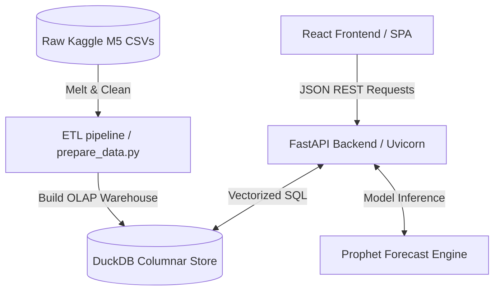
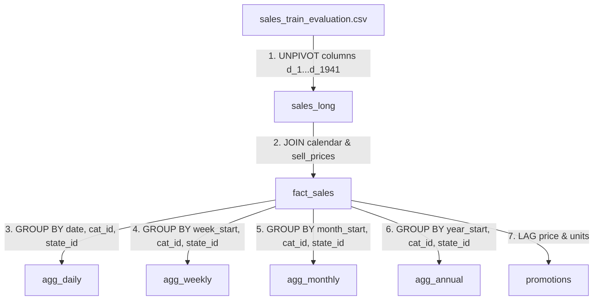
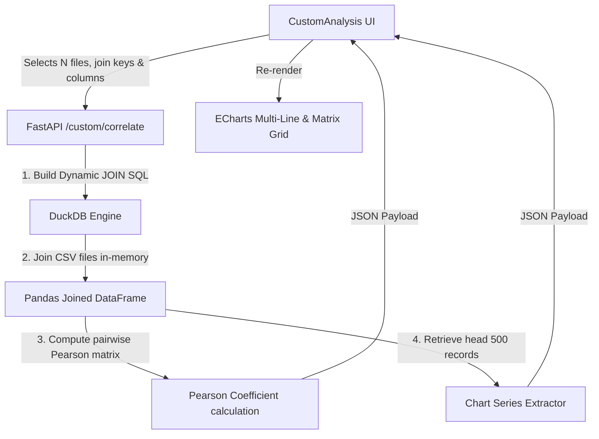

# DemandDoc — Full Project Technical Documentation

This document serves as the master technical design reference for **DemandDoc**, a premium Retail Demand & Sales Analytics Engine. It covers architecture, data workflows, database schemas, machine learning models, and frontend state synchronization.

---

## 1. System Overview & Purpose

DemandDoc is an enterprise-grade analytics dashboard designed to process and analyze massive transactional datasets. It integrates:
* **Interactive Business Intelligence (BI)**: Sub-second aggregations of daily retail transactions, sales revenue, units sold, and geographic breakdown.
* **AI-Driven Demand Forecasting**: Multi-period predictive modeling with integrated replenishment planning (safety stock and reorder points).
* **Pricing Simulator**: Interactive what-if scenario forecasting based on price elasticity of demand.
* **Custom Dataset Ingestion**: Automatic column mapping, profiling, and dynamic $N$-file in-memory SQL joins and correlation.
* **Print-Ready PDF Reports**: Professional white-paper layout detailing operational strengths, weaknesses, and SWOT risks.

---

## 2. High-Level Architecture (HLD)

DemandDoc uses a modern decoupled architecture. The frontend React application interacts via JSON REST interfaces with the FastAPI backend. The backend queries an embedded DuckDB database to execute OLAP queries.




---

## 3. Database ETL & Materialization Pipeline

The raw transactional data consists of wide daily columns (`d_1` to `d_1941`) containing sales volumes. The ETL pipeline (`prepare_data.py`) unpivots this data into a long transactional fact table and computes pre-aggregated summaries.

### A. ETL Data Flow


### B. Core ETL Implementations
Below is the unpivoting (melting) and fact table generation SQL executed in DuckDB:

```python
# Melt Sales Train Evaluation
con.execute("""
    CREATE TABLE sales_long AS 
    WITH raw_sales AS (
        SELECT * FROM read_csv_auto('backend/data/raw/sales_train_evaluation.csv')
    )
    UNPIVOT raw_sales 
    ON columns('^d_[0-9]+$')
    INTO
        NAME d
        VALUE units_sold
""")

# Create Fact Table with Prices and Dates
con.execute("""
    CREATE TABLE fact_sales AS 
    SELECT 
        s.item_id, s.dept_id, s.cat_id, s.store_id, s.state_id, s.d,
        CAST(s.units_sold AS INTEGER) as units_sold,
        c.date, c.wm_yr_wk, c.weekday, c.wday, c.month, c.year,
        c.event_name_1, c.event_type_1, c.snap_CA, c.snap_TX, c.snap_WI,
        p.sell_price,
        (s.units_sold * p.sell_price) as revenue
    FROM sales_long s
    JOIN calendar c ON s.d = c.d
    LEFT JOIN sell_prices p 
        ON s.store_id = p.store_id 
        AND s.item_id = p.item_id 
        AND c.wm_yr_wk = p.wm_yr_wk
""")
```

### C. Promotional Logic Formulation
Promotions are identified when the price drops by more than 5% relative to the previous week and units sold increase:

```python
con.execute("""
    CREATE TABLE promotions AS
    WITH weekly_lag AS (
        SELECT 
            *,
            LAG(avg_price) OVER (PARTITION BY item_id, store_id ORDER BY wm_yr_wk) as prev_price,
            LAG(weekly_units) OVER (PARTITION BY item_id, store_id ORDER BY wm_yr_wk) as prev_units
        FROM item_weekly_stats
    )
    SELECT 
        item_id, store_id, cat_id, state_id, wm_yr_wk, week_start_date,
        avg_price, prev_price, weekly_units, prev_units,
        CASE 
            WHEN prev_price IS NOT NULL 
                 AND avg_price < (prev_price * 0.95) 
                 AND weekly_units > prev_units THEN 1 
            ELSE 0 
        END as is_promotion
    FROM weekly_lag
""")
```

---

## 4. Machine Learning & Forecasting Models

DemandDoc fits time-series models on daily aggregates using a pre-computation cache strategy to prevent frontend loading delays.

### A. Time-Series Prophet Implementation
Prophet is the primary model used for forecasting:

```python
# Fit Prophet with holiday indicators
m = Prophet(holidays=holidays_df, daily_seasonality=False, weekly_seasonality=True, yearly_seasonality=True)
m.fit(df)

# Forecast 28 days into the future
future = m.make_future_dataframe(periods=28, freq='D')
forecast = m.predict(future)
```

### B. Holt-Winters Exponential Smoothing Fallback
If Prophet fails to fit due to missing libraries or data sparsity, the engine falls back to Holt-Winters additive smoothing:

```python
from statsmodels.tsa.holtwinters import ExponentialSmoothing

hw_model = ExponentialSmoothing(
    ts_df['y'], 
    seasonal_periods=7, 
    trend='add', 
    seasonal='add'
)
hw_fit = hw_model.fit()
pred_all = hw_fit.predict(start=ts_df.index[0], end=ts_df.index[-1] + pd.Timedelta(days=28))
```

### C. Inventory Safety Stock & Replenishment Planning
The forecasting engine calculates inventory thresholds based on lead time variability and target service levels:
$$\text{Safety Stock} = Z \times \sigma_d \times \sqrt{L}$$
$$\text{Reorder Point (ROP)} = (\mu_d \times L) + \text{Safety Stock}$$

* **Service Level Multiplier ($Z$)**:
  * 90% Service Level: $Z = 1.28$
  * 95% Service Level: $Z = 1.64$
  * 99% Service Level: $Z = 2.33$
* **Lead Time ($L$)**: The standard supplier delivery cycle (configured dynamically via UI dropdown).
* **Mean Daily Demand ($\mu_d$)**: Average forecasted units required per day.
* **Demand Standard Deviation ($\sigma_d$)**: The daily standard deviation of units sold.

---

## 5. N-File In-Memory Correlation Join Flow

When multiple custom CSV datasets are uploaded, the engine merges them on the fly using dynamic in-memory joins.


### A. Data Flow Layout


### B. Dynamic Join SQL Query Construction
The FastAPI endpoint joins $N$ CSV files on user-specified join keys. It aliasses the tables from `f0` to `fN` and appends suffixes to the columns to avoid collisions:

```python
# Construct SELECT and JOIN SQL on the fly
select_parts = [f'CAST(f0."{key_list[0]}" AS VARCHAR) as join_key']
join_clauses = []

for i, (filename, key, col) in enumerate(zip(file_list, key_list, col_list)):
    f_path = os.path.join(raw_dir, os.path.basename(filename))
    select_parts.append(f'f{i}."{col}" as "{col}_f{i}"')
    
    if i > 0:
        join_clauses.append(
            f"JOIN read_csv_auto('{f_path}') f{i} "
            f"ON CAST(f0.\"{key_list[0]}\" AS VARCHAR) = CAST(f{i}.\"{key}\" AS VARCHAR)"
        )

query = f"""
    SELECT {', '.join(select_parts)}
    FROM read_csv_auto('{first_file_path}') f0
    {' '.join(join_clauses)}
    WHERE f0."{key_list[0]}" IS NOT NULL
"""
```

---

## 6. Frontend State & Caching Architecture

### A. Zustand Global Store
Zustand manages the parameters for all panel views:

```typescript
export const useStore = create<AppState>((set) => ({
  dateFrom: '2015-01-01',
  dateTo: '2016-01-01',
  category: 'ALL',
  stateLocation: 'ALL',
  granularity: 'monthly',
  activeView: 'Overview',
  uploadedFilename: null,
  uploadedFilenames: [],
  isPrinting: false,

  setDateRange: (from, to) => set({ dateFrom: from, dateTo: to }),
  setCategory: (cat) => set({ category: cat }),
  setStateLocation: (loc) => set({ stateLocation: loc }),
  setGranularity: (g) => set({ granularity: g }),
  setActiveView: (v) => set({ activeView: v }),
  setUploadedFilename: (f) => set({ uploadedFilename: f }),
  setUploadedFilenames: (fs) => set({ uploadedFilenames: fs }),
  setIsPrinting: (v) => set({ isPrinting: v }),
}));
```

### B. TanStack Query Fetching & Invalidation
All React panels use TanStack Query hooks. If a global filter (e.g., `dateFrom` or `category`) changes in the Zustand store, the query caches are invalidated, triggering background refetches:

```typescript
const { data: customTrend, isLoading } = useQuery({
  queryKey: ["customTrend", uploadedFilename, category, stateFilter, dateFrom, dateTo, granularity],
  queryFn: () => fetch(`/api/custom/trend?${queryParams}&granularity=${granularity}`).then((r) => r.json()),
  enabled: !!uploadedFilename,
});
```

---

## 7. Print-Ready PDF Report Rendering
To prevent browser print-dialog layout bugs on dark-themed SPAs:
1. A separate React component (`PdfReport.tsx`) compiles all metrics (KPIs, trends, category shares, safety stock figures, promotions, root cause logs) in a clean, high-contrast, black-and-white theme.
2. The component is mounted inside a print-only root:
   ```html
   <div id="pdf-report-root" class="print-only">...</div>
   ```
3. Custom `@media print` rules in `index.css` hide the main application and display the print root, forcing page breaks between sections:
   ```css
   @media print {
     body {
       background: white !important;
       color: black !important;
     }
     .no-print {
       display: none !important;
     }
     .print-only {
       display: block !important;
     }
     .page-break {
       page-break-after: always;
     }
   }
   ```
4. Handles the print dialog lifecycle to avoid unmounting the component too quickly:
   ```typescript
   useEffect(() => {
     if (isPrinting) {
       // Wait for ECharts animations to complete, then open print dialog
       const timer = setTimeout(() => {
         window.print();
       }, 1500);
       
       const handleAfterPrint = () => {
         onPrintComplete();
       };
       
       window.addEventListener('afterprint', handleAfterPrint);
       return () => {
         clearTimeout(timer);
         window.removeEventListener('afterprint', handleAfterPrint);
       };
     }
   }, [isPrinting]);
   ```
