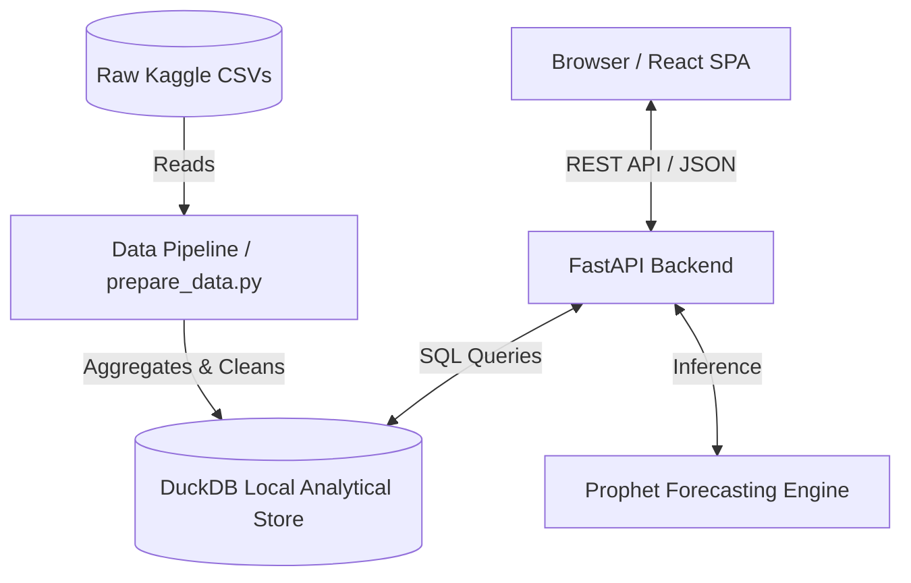
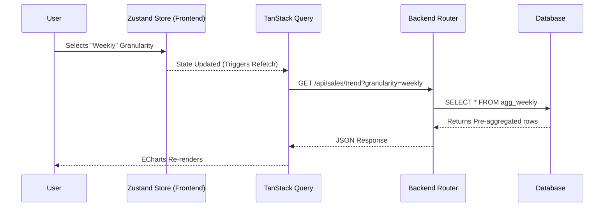

# Architecture & Technical Documentation

This document outlines the architectural decisions, system design, data flow, and tech stack utilized in the Retail Demand & Sales Analytics Dashboard.

---

## 1. High-Level Design (HLD)

The system follows a modern decoupled architecture where a React frontend communicates with a Python/FastAPI backend, which in turn queries a heavily optimized DuckDB analytical database and invokes Prophet for ML forecasting.

---

## 2. Low-Level Design (LLD) & Data Flow

When a user changes a filter (e.g., Granularity from Monthly to Weekly), the data flows as follows:

---

## 3. Tech Stack & Justification

| Component | Technology | Justification |
| :--- | :--- | :--- |
| **Frontend Framework** | React 18 + Vite + TS | High performance, strict typing, and instant HMR via Vite. |
| **State Management** | Zustand | Lightweight and boilerplate-free compared to Redux; perfect for simple global filter states. |
| **Data Fetching** | TanStack Query | Built-in caching, background re-fetching, and loading state management. |
| **Charting** | ECharts (echarts-for-react) | High-performance canvas-based rendering capable of handling thousands of data points smoothly. |
| **Backend Framework** | FastAPI (Python) | Extremely fast, built-in validation via Pydantic, and automatic Swagger docs. |
| **Database** | DuckDB | Embeddable OLAP database. Provides sub-second aggregations over millions of rows without a dedicated server. |
| **Machine Learning** | Prophet | Robust time-series forecasting that handles missing data and large outliers well, explicitly built for retail/business forecasting. |

---

## 4. Optimization & Data Pre-Processing

To ensure sub-second latency on the frontend:
- **Pre-aggregation**: The `prepare_data.py` pipeline melts the wide-format Kaggle CSV (`sales_train_evaluation.csv`) into a columnar fact table and pre-aggregates key metrics.
- **Columnar Storage**: DuckDB stores the analytical tables in a compressed, columnar format (`warehouse.duckdb`), allowing the API to read only the specific columns needed for a visualization.
- **In-Memory Forecast Caching**: Prophet models can take time to fit. The architecture caches trained models or persists daily/weekly forecast points to avoid computing the ML inference during live API calls.

---

## 5. API Reference

### `GET /api/sales/kpis`
- **Description**: Retrieves top-level metrics (Revenue, Units Sold, Unique Items).
- **Params**: `granularity` (daily, weekly, monthly), `state_id`, `cat_id`.
- **Response**: `{"revenue": 1200000, "units_sold": 850000, "items": 3049}`

### `GET /api/sales/trend`
- **Description**: Fetches time-series data for the main Revenue Trend line chart.
- **Params**: `granularity`, `start_date`, `end_date`.
- **Response**: `[{"date": "2015-01", "revenue": 45000}, ...]`

### `GET /api/sales/forecast`
- **Description**: Invokes the Prophet model to return predicted future sales.
- **Params**: `granularity`, `periods` (int).
- **Response**: `[{"date": "2016-06", "yhat": 50000, "yhat_lower": 48000, "yhat_upper": 52000}, ...]`

### `GET /api/sales/promotions`
- **Description**: Returns percentage lift for major holiday events.
- **Response**: `[{"name": "Super Bowl", "lift": 0.15}, ...]`

### `GET /api/sales/root_cause`
- **Description**: Returns text-based anomaly explanations.
- **Response**: `[{"date": "2015-11-26", "issue": "Thanksgiving Out of Stock", "impact": -5000}]`

### `GET /api/sales/geographic`
- **Description**: Returns revenue distribution by state for the pie chart.
- **Response**: `[{"state": "CA", "revenue": 500000}, ...]`

### `GET /api/sales/top_products`
- **Description**: Returns the highest selling items in the selected category.
- **Response**: `[{"id": "HOBBIES_1_001", "name": "Item 1", "revenue": 15000}, ...]`

---

## 6. Features & Visualizations Mapping

| Feature | Visual Component | Data Source API | Backend Processing / ML |
| :--- | :--- | :--- | :--- |
| **Top KPIs** | Grid of numeric cards with percent change | `/api/sales/kpis` | Basic `SUM()` and `COUNT()` in DuckDB over the filtered period |
| **Revenue Trend** | ECharts Line Chart (Smooth) | `/api/sales/trend` | Time-series `GROUP BY` aggregations in DuckDB |
| **Category Mix** | ECharts Treemap | `/api/sales/kpis` (Category slice) | Hierarchical aggregation (Dept -> Category -> Item) |
| **Top Products** | Tailwind List/Table | `/api/sales/top_products` | `ORDER BY revenue DESC LIMIT 10` |
| **Demand Forecast** | ECharts Line Chart with Confidence Bands | `/api/sales/forecast` | Scikit-learn / Prophet model fit on historical trend |
| **Promotion Impact** | ECharts Bar Chart (Lift %) | `/api/sales/promotions` | Calculated baseline vs actual sales during SNAP/Events |
| **Anomaly Root Cause** | Markdown / Text List | `/api/sales/root_cause` | Rule-based anomaly detection (e.g., standard deviation drops) |
| **Pricing Simulator** | Interactive Sliders & Live Chart | `/api/sales/forecast` | Re-runs predictive model based on user-adjusted elasticity variables |
| **Geographic Insights**| ECharts Pie Chart | `/api/sales/geographic` | `GROUP BY state_id` (CA, TX, WI) |
